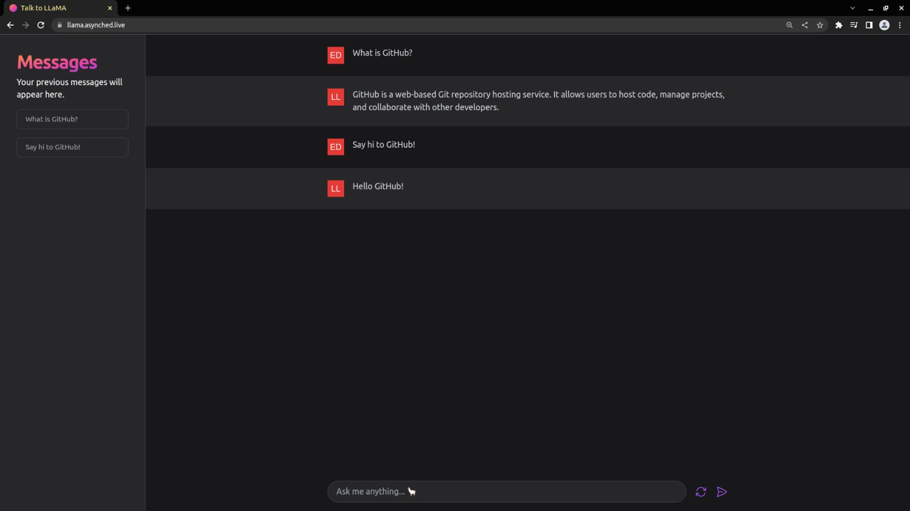

# Talk to LLaMA

A front-end for interacting with the LLaMA GPT model

## Preview

## How to run

- Clone the repository
- Install the dependencies with `pnpm install` (or any other node package manager)
- Run the application with `pnpm dev`

## How to build

- Clone the repository
- Install the dependencies with `pnpm install` (or any other node package manager)
- Build the application with `pnpm build`

## Author

|  |
| ------------------------------------------------------ |
| [Eder Lima](https://github.com/asynched)               |
